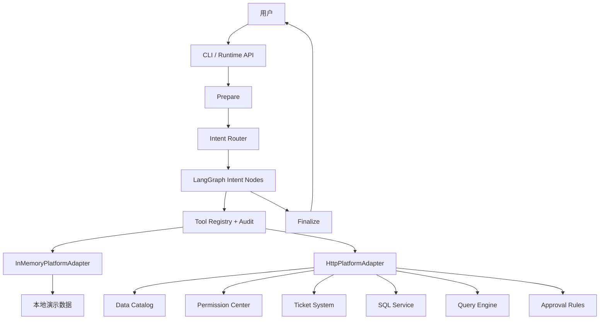

# Data Agent

基于 `docs/prd_v2.md` 实现的企业数据平台智能助手。项目使用 LangGraph
编排数据资产发现、表/字段/指标解释、权限查询与申请、SQL 诊断优化、只读查询、
查询结果解释、审批辅助、任务续跑和全链路审计。

核心设计原则：

- LLM 负责理解、规划、解释和编排。
- Tool 负责查询、检查和执行。
- 数据平台负责事实、权限和数据。
- Agent 不直接授权、不编造事实、不执行非只读 SQL。

## 功能总览

| 模块 | 已实现能力 |
| --- | --- |
| 数据资产发现 | 自然语言搜索、候选排序、推荐表、表解释、字段解释、指标解释、数据血缘 |
| 权限体系 | 单资源权限检查、批量权限检查、角色解释、角色列表、历史权限、申请推荐、创建工单、工单状态 |
| 权限申请 | 自动补全资源/动作/环境/期限/理由，生成预览，LangGraph 人工确认中断，确认后创建工单 |
| 任务续跑 | 无权限查询会保存 `pending_task`；工单审批通过后自动重新检查权限并继续原 SQL |
| SQL 助手 | SQL 解析、只读校验、DDL/索引/统计信息自动补全、EXPLAIN、问题诊断、索引建议、JOIN 优化、SQL 重写 |
| Query Assistant | 查询权限检查、风险检查、只读执行、执行状态、结果查询、取消查询、结果解释 |
| 审批 Agent | 工单上下文、申请人角色、角色历史权限、重复申请、风险分析、审批历史和参考建议 |
| 多轮上下文 | 按 `session_id` 保留对话消息、任务状态、资源、SQL、工单和查询结果引用 |
| 安全 | 默认只允许 `SELECT`，阻止 DML/DDL、多语句和 export 静默执行，写操作必须人工确认 |
| 审计 | 每次工具调用记录时间、用户、会话、任务、意图、请求、响应、延迟、SQL、工单和查询 ID |
| Prompt | 17 类意图均有独立 Prompt，包含执行顺序、事实约束、输出格式和风险规则 |
| 接口 | 31 个平台工具都有明确 REST 方法、路径和请求模型；所有请求通过 `X-User-Id` 请求头传递当前用户 |

## 架构



主要分层：

```text
src/data_agent/
├── graph.py             LangGraph StateGraph、条件路由、检查点、Runtime
├── nodes.py             所有 Agent 节点和人工确认续跑逻辑
├── routing.py           规则路由、可选 LLM 路由和实体抽取
├── llm.py               LLM 环境配置、模型构建和路由注入
├── prompts.py           系统 Prompt、路由 Prompt、17 类业务 Prompt
├── state.py             LangGraph AgentState / Task State
├── models.py            意图、资源、权限动作、环境和审计模型
├── services.py          数据目录/权限/SQL/查询/审批协议
├── api_contracts.py     31 个 REST 接口的 Pydantic 请求模型和平台配置
├── tooling.py           工具注册、调用批处理和审计事件
├── formatting.py        基于工具事实的回答与卡片格式化
├── adapters/
│   ├── memory.py        可离线运行的本地平台
│   └── http.py          可直接接入真实平台的 HTTP 实现
├── cli.py               命令行入口
└── __main__.py          python -m data_agent 入口

uml/
└── all.puml             全流程 PlantUML 时序图
```

## LangGraph 路由

`StateGraph` 的固定起点为 `prepare -> route`，之后按意图进入专用节点。

| Intent | LangGraph 节点 | 核心工具 |
| --- | --- | --- |
| `data_discovery` | `discover_assets` | `search_data_assets`、`check_permission`、`recommend_data_asset` |
| `table_explain` | `explain_table` | `get_table_metadata`、`get_data_lineage` |
| `column_explain` | `explain_columns` | `get_table_metadata`、`get_column_metadata` |
| `metric_explain` | `explain_metric` | `get_metric_definition`、`search_metrics` |
| `permission_check` | `check_permission` | `check_permission`、`recommend_permission`、`get_permission_history` |
| `permission_apply` | `apply_permission` | `recommend_permission`、`create_permission_ticket` |
| `permission_history` | `permission_history` | `get_permission_history` |
| `ticket_status` | `ticket_status` | `get_ticket_status` |
| `role_explain` | `explain_role` | `get_role_detail` |
| `sql_analyze` | `analyze_sql` | `validate_sql`、`parse_sql`、`get_table_ddl`、`get_indexes`、`get_statistics`、`explain_sql` |
| `sql_optimize` | `optimize_sql` | SQL 上下文工具、`optimize_sql` |
| `sql_rewrite` | `rewrite_sql` | SQL 上下文工具、`rewrite_sql` |
| `query_execute` | `prepare_query -> execute_query` | `validate_sql`、`parse_sql`、`batch_check_permission`、`execute_query` |
| `query_explain` | `explain_query_result` | `get_query_result` |
| `approval_context` | `approval_context` | `get_ticket_context` |
| `approval_risk` | `approval_risk` | `get_ticket_context`、`analyze_risk`、`get_approval_history` |
| `unknown` | `unknown` | 无 |

权限申请使用 LangGraph `interrupt`，无权限时弹出三步选择：

```text
用户请求
  ↓
recommend_permission
  ↓
interrupt 1：是否同意一键提单？
  ↓
用户同意
  ↓
interrupt 2：选择申请期限 7 / 15 / 30 天
  ↓
get_user_roles
  ├── 多个角色 → interrupt 3：选择为哪个角色申请
  └── 一个角色 → 自动选择
  ↓
create_permission_ticket
```

查询续跑流程：

```text
query_execute
  ↓
validate_sql
  ↓
batch_check_permission
  ├── 全部通过 → execute_query → 返回结果
  └── 有资源无权限
          ↓
      保存 pending_task.sql
          ↓
      弹出“是否同意一键提单”
          ↓
      选择 7 / 15 / 30 天
          ↓
      多角色时选择角色
          ↓
      创建工单
          ↓
      审批通过
          ↓
      查询工单状态
          ↓
      重新进入 prepare_query
          ↓
      execute_query
```

## Task State

会话状态由 `MemorySaver` 或外部 checkpointer 按 `session_id` 持久化。

核心字段：

```text
user_id
session_id
task_id
message
context
intent
intent_confidence
entities
business_goal
identified_resources
required_permissions
permission_result
permission_preview
permission_recommendation
ticket
ticket_status
pending_task
generated_sql
sql_context
sql_analysis
query_status
result_reference
approval_context
response
messages
audit_events
tool_calls
created_at
updated_at
```

`pending_task` 示例：

```json
{
  "intent": "query_execute",
  "sql": "SELECT * FROM dwd_order WHERE dt = '2026-09-01'",
  "resources": ["dw.dwd_order"],
  "pending_action": "query"
}
```

## 平台接口

`HttpPlatformAdapter` 已直接写出所有 Agent 所需接口。生产环境只需配置平台地址和
Token，不需要再编写一层抽象调用。

### 用户身份传递

所有 HTTP 请求统一携带：

```http
X-User-Id: u123
```

`ToolRegistry` 在调用工具前通过 `HttpPlatformAdapter.bind_user(user_id)` 绑定当前
用户上下文。权限检查、批量权限检查、创建工单、查询执行等接口不再把 `user_id`
或 `applicant_id` 放进 query string / JSON body。

### 数据目录

| 工具 | 方法 | 路径 | 请求 |
| --- | --- | --- | --- |
| `search_data_assets` | `GET` | `/api/v1/data-assets/search` | `query`、`limit` |
| `get_table_metadata` | `GET` | `/api/v1/data-assets/{table}` | 表 ID |
| `get_column_metadata` | `GET` | `/api/v1/data-assets/{table}/columns` | `column` 可选 |
| `get_data_lineage` | `GET` | `/api/v1/data-assets/{table}/lineage` | 表 ID |
| `search_metrics` | `GET` | `/api/v1/metrics/search` | `query`、`limit` |
| `get_metric_definition` | `GET` | `/api/v1/metrics/{metric}` | 指标 ID |
| `recommend_data_asset` | `POST` | `/api/v1/data-assets/recommend` | `goal`、`resources` |

### 权限与工单

| 工具 | 方法 | 路径 | 请求 |
| --- | --- | --- | --- |
| `check_permission` | `POST` | `/api/v1/tools/permission/check` | Header `X-User-Id`、`resource`、`action`、`env` |
| `batch_check_permission` | `POST` | `/api/v1/tools/permission/batch-check` | Header `X-User-Id`、`checks` |
| `get_user_roles` | `GET` | `/api/v1/users/me/roles` | Header `X-User-Id` |
| `get_role_detail` | `GET` | `/api/v1/roles/{role_id}` | 角色 ID |
| `get_permission_history` | `GET` | `/api/v1/users/me/permission-history` | Header `X-User-Id`、`role_id`、`resource_id` |
| `recommend_permission` | `POST` | `/api/v1/tools/permission/recommend` | Header `X-User-Id`、资源、动作、环境、任务目标 |
| `create_permission_ticket` | `POST` | `/api/v1/tools/permission/tickets` | Header `X-User-Id`、角色、资源、期限和理由 |
| `get_ticket_status` | `GET` | `/api/v1/tools/permission/tickets/{ticket_id}` | 工单 ID |

### SQL

| 工具 | 方法 | 路径 | 请求 |
| --- | --- | --- | --- |
| `parse_sql` | `POST` | `/api/v1/tools/sql/parse` | `sql` |
| `get_table_ddl` | `GET` | `/api/v1/metadata/tables/{table}/ddl` | 表 ID |
| `get_indexes` | `GET` | `/api/v1/metadata/tables/{table}/indexes` | 表 ID |
| `get_statistics` | `GET` | `/api/v1/metadata/tables/{table}/statistics` | 表 ID |
| `explain_sql` | `POST` | `/api/v1/tools/sql/explain` | `sql` |
| `validate_sql` | `POST` | `/api/v1/tools/sql/validate` | `sql` |
| `optimize_sql` | `POST` | `/api/v1/tools/sql/optimize` | `sql`、`context` |
| `rewrite_sql` | `POST` | `/api/v1/tools/sql/rewrite` | `sql`、`context` |

### 查询引擎

| 工具 | 方法 | 路径 | 请求 |
| --- | --- | --- | --- |
| `execute_query` | `POST` | `/api/v1/tools/query/execute` | Header `X-User-Id`、`sql`、`env` |
| `get_query_status` | `GET` | `/api/v1/tools/query/{query_id}/status` | 查询 ID |
| `get_query_result` | `GET` | `/api/v1/tools/query/{query_id}/result` | 查询 ID |
| `cancel_query` | `POST` | `/api/v1/tools/query/{query_id}/cancel` | 查询 ID |

### 审批

| 工具 | 方法 | 路径 | 请求 |
| --- | --- | --- | --- |
| `get_ticket_context` | `GET` | `/api/v1/tools/approval/tickets/{ticket_id}/context` | 工单 ID |
| `check_duplicate_permission` | `POST` | `/api/v1/tools/approval/tickets/{ticket_id}/check-duplicate` | Header `X-User-Id`、`application` |
| `analyze_risk` | `POST` | `/api/v1/tools/approval/tickets/{ticket_id}/risk` | `ticket`、`context` |
| `get_approval_history` | `GET` | `/api/v1/tools/approval/tickets/{ticket_id}/history` | 工单 ID |

接口请求模型定义在 `src/data_agent/api_contracts.py`，HTTP 调用定义在
`src/data_agent/adapters/http.py`。

## 接口示例

权限检查：

```json
POST /api/v1/tools/permission/check
Header: X-User-Id: u123
{
  "resource": {
    "type": "table",
    "database": "dw",
    "name": "dwd_order"
  },
  "action": "select",
  "env": "prod"
}
```

创建工单：

```json
POST /api/v1/tools/permission/tickets
Header: X-User-Id: u123
{
  "role_id": "r_sales_analyst",
  "resource": {
    "type": "table",
    "database": "dw",
    "name": "dwd_order"
  },
  "action": "select",
  "env": "prod",
  "duration_days": 7,
  "reason": "订单明细分析",
  "approver_id": "销售数据 Owner",
  "auto_fill": true
}
```

执行只读查询：

```json
POST /api/v1/tools/query/execute
Header: X-User-Id: u123
{
  "sql": "SELECT dt, region, order_count FROM dw.dws_sales_daily WHERE dt >= '2026-09-01'",
  "env": "prod"
}
```

## Prompt 目录

所有 Prompt 位于 `src/data_agent/prompts.py`。公用约束包括事实来源、权限确认、
只读限制、SQL 依据、审批边界和审计要求。

| Prompt | 目标 | 关键约束 |
| --- | --- | --- |
| `SYSTEM_PROMPT` | 全局身份和行为边界 | 不编造、不授权、先确认、只读优先 |
| `INTENT_SCHEMA_PROMPT` | 意图与实体 JSON Schema | 17 类意图、资源/动作/环境/SQL/工单实体 |
| `INTENT_ROUTER_PROMPT` | 模型路由 | 无法确认的实体保留 `null` |
| `data_discovery` | 找表和推荐 | 搜索、元数据、权限和推荐必须分别调用工具 |
| `table_explain` | 表解释 | 业务含义、粒度、字段和血缘必须来自目录 |
| `column_explain` | 字段解释和比较 | 必须获取字段元数据，禁止根据名称推断定义 |
| `metric_explain` | 指标口径 | 优先标准 Metric Definition |
| `permission_check` | 权限和原因解释 | 权限结论只来自 Permission Center |
| `permission_apply` | 权限申请 | 一键提单确认、7/15/30 天期限选择、多角色选择后创建工单 |
| `permission_history` | 历史权限 | 区分有效、审批中和过期记录 |
| `ticket_status` | 工单状态和续跑 | 只有 approved 才恢复原任务 |
| `role_explain` | 角色解释 | 作用域和边界来自角色元数据 |
| `sql_analyze` | SQL 检查 | 校验、解析、元数据、统计信息和 EXPLAIN |
| `sql_optimize` | SQL 优化 | 每条索引/JOIN 建议必须引用执行依据 |
| `sql_rewrite` | SQL 重写 | 不得改变业务口径，无法证明等价时说明 unknown |
| `query_execute` | 只读查询 | SQL 校验、逐表权限检查、风险检查后执行 |
| `query_explain` | 结果解释 | 仅解释真实结果，无数据时不推断因果 |
| `approval_context` | 审批上下文 | 聚合工单、申请人、角色、历史权限和重复申请 |
| `approval_risk` | 审批风险 | 规则驱动风险，仅提供参考建议 |
| `unknown` | 未识别请求 | 引导用户补充目标，不猜测后调用高风险工具 |

Prompt 渲染 API：

```python
from data_agent.models import Intent
from data_agent.prompts import render_intent_prompt, render_prompt

router_prompt = render_intent_prompt(
    message="dwd_order 是干嘛的？",
    user_id="u123",
    session_id="s001",
    context="{}",
    task_state="{}",
)

answer_prompt = render_prompt(
    Intent.TABLE_EXPLAIN,
    message="dwd_order 是干嘛的？",
    user_id="u123",
    session_id="s001",
    context="{}",
    entities="{}",
    tool_results="{}",
    task_state="{}",
)
```

## 可选 LLM 路由

默认 `RuleBasedIntentRouter` 可以完全离线运行。启用 LLM 时，通过环境变量或 CLI
配置 OpenAI-compatible Chat Model：

```bash
export DATA_AGENT_LLM_ENABLED=true
export DATA_AGENT_LLM_PROVIDER=openai
export DATA_AGENT_LLM_MODEL=gpt-5
export DATA_AGENT_LLM_API_KEY=replace-with-your-key
export DATA_AGENT_LLM_BASE_URL=https://api.openai.com/v1
export DATA_AGENT_LLM_TEMPERATURE=0
export DATA_AGENT_LLM_TIMEOUT_SECONDS=30
export DATA_AGENT_LLM_MIN_CONFIDENCE=0.55
```

对应 CLI 参数：

```bash
.venv/bin/python main.py chat \
  --llm-enabled \
  --llm-provider openai \
  --llm-model gpt-5 \
  --llm-api-key replace-with-your-key \
  --llm-base-url https://api.openai.com/v1 \
  --llm-temperature 0 \
  --llm-timeout-seconds 30 \
  --llm-min-confidence 0.55
```

也可以直接注入已有 LangChain Chat Model：

```python
from langchain_openai import ChatOpenAI

from data_agent.adapters.http import HttpPlatformAdapter
from data_agent.graph import DataAgentRuntime
from data_agent.routing import LlmIntentRouter

model = ChatOpenAI(model="gpt-5")
runtime = DataAgentRuntime(
    HttpPlatformAdapter(
        base_url="https://data-platform.example.com",
        token="your-token",
    ),
    router=LlmIntentRouter(model),
)
```

模型输出不是合法 JSON、低于置信度阈值或调用失败时，会自动回退到规则路由。
LLM 配置定义在 `src/data_agent/llm.py`，支持 `openai` 和
`openai_compatible` Provider。

## 安装

```bash
python -m venv .venv
.venv/bin/pip install -e ".[dev]"
```

启用 LLM 时安装可选依赖：

```bash
.venv/bin/pip install -e ".[dev,llm]"
```

运行测试：

```bash
.venv/bin/pytest -q
```

## 本地演示

最终用户不需要理解 `ask` 和 `chat`，CLI 会自动判断：

```bash
# 没有任何参数：默认进入交互式多轮对话
.venv/bin/python main.py

# 直接输入一句话：自动按单轮 ask 处理
.venv/bin/python main.py "dwd_order 是干嘛的？"
```

显式的开发和自动化命令仍然保留：

```bash
.venv/bin/python main.py chat --user-id u123

.venv/bin/python main.py ask "dwd_order 是干嘛的？" --user-id u123

.venv/bin/python main.py ask "pay_amount 和 settle_amount 有什么区别？" --user-id u123

.venv/bin/python main.py ask "我要查每天销售额，应该用哪张表？" --user-id u123

.venv/bin/python main.py ask "我有 dwd_order 的权限吗？" --user-id u123

.venv/bin/python main.py ask "r_sales_analyst 这个 role 有什么权限？" --user-id u123

.venv/bin/python main.py ask "这个 SQL 很慢：SELECT * FROM dwd_order WHERE dt='2026-09-01'" --user-id u123

.venv/bin/python main.py ask "执行一下这个 SQL：SELECT dt, region, order_count FROM dw.dws_sales_daily WHERE dt >= '2026-09-01'" --user-id u123
```

### Chat 空闲超时

交互式 `chat` 默认在空闲 **10 分钟（600 秒）** 后自动结束，并在剩余
120 秒时提醒用户。配置方式：

```bash
export DATA_AGENT_CHAT_IDLE_TIMEOUT_SECONDS=600
export DATA_AGENT_CHAT_TIMEOUT_WARNING_SECONDS=120
```

也可以使用 CLI 参数：

```bash
.venv/bin/python main.py chat \
  --chat-idle-timeout-seconds 600 \
  --chat-timeout-warning-seconds 120
```

超时行为：

- 只是结束当前交互式会话，不取消已提交的权限工单。
- 权限确认、期限选择和角色选择弹窗同样受空闲超时保护。
- 非 TTY 管道、脚本和自动化环境不强制空闲退出。
- 配置持久化 Checkpointer 后，可以使用同一个 `session_id` 恢复任务状态。

申请权限并自动确认：

```bash
.venv/bin/python main.py ask "帮我申请 dwd_order SELECT 权限 7 天，用于订单分析" --user-id u123 --yes
```

## 连接真实平台

环境变量：

```bash
export DATA_AGENT_ADAPTER=http
export DATA_PLATFORM_BASE_URL=https://data-platform.example.com
export DATA_PLATFORM_TOKEN=replace-with-your-token
export DATA_PLATFORM_TIMEOUT_SECONDS=10

export DATA_AGENT_LLM_ENABLED=true
export DATA_AGENT_LLM_MODEL=gpt-5
export DATA_AGENT_LLM_API_KEY=replace-with-your-key
export DATA_AGENT_LLM_BASE_URL=https://api.openai.com/v1
```

启动：

```bash
.venv/bin/python main.py chat --adapter http --user-id u123
```

也可以直接传参：

```bash
.venv/bin/python main.py ask "dwd_order 是干嘛的？" \
  --adapter http \
  --platform-base-url https://data-platform.example.com \
  --platform-token replace-with-your-token \
  --user-id u123
```

真实平台需要实现 README 中列出的 31 个 REST 接口。如果平台协议略有不同，只需修改
`HttpPlatformAdapter`，LangGraph 节点和 Prompt 不需要改动。

## 安全设计

1. Agent 没有直接授权能力，所有授权由 Permission Center 和审批流程完成。
2. 默认仅允许 `SELECT` 或 `WITH` 只读查询。
3. `INSERT`、`UPDATE`、`DELETE`、DDL、多语句 SQL 会在执行前被拒绝。
4. `export` 和 `download` 使用独立权限动作和更高风险等级，不继承普通查询权限。
5. 权限工单必须经过“一键提单确认、期限选择、角色选择”，Agent 不会静默提交。
6. 敏感字段、生产环境、长期权限、越权范围和高风险操作进入审批风险规则。
7. 查询没有 `WHERE`、使用 `SELECT *` 或涉及大表时会产生风险提示。
8. SQL 优化只生成建议和 DDL，不直接执行 DDL。
9. LLM 不能直接决定权限、角色、表结构、执行计划或查询结果。

## 可观测性与审计

`ToolRegistry` 会记录：

```text
timestamp
user_id
session_id
task_id
intent
tool
request
response
latency_ms
error
sql
permission_check
ticket_id
query_id
```

自定义审计落库：

```python
def audit_sink(event: dict) -> None:
    # 写入日志平台、Kafka、ClickHouse 或 OpenTelemetry
    ...


runtime = DataAgentRuntime(
    HttpPlatformAdapter.from_environment(),
    audit_sink=audit_sink,
)
```

建议生产环境同时记录：

- LangGraph checkpoint 和任务恢复记录。
- 权限检查和工单号的关联关系。
- SQL 审计、查询 ID 和结果引用。
- Prompt 版本、模型名称、模型请求 ID 和工具调用链。
- P99 延迟、工具错误率和任务完成率。

## 多轮任务

同一 `session_id` 会复用完整任务状态：

```text
用户：执行 SELECT * FROM dwd_order WHERE dt='2026-09-01'
Agent：没有权限，是否同意一键提单？

用户：同意
Agent：请选择申请期限 7 / 15 / 30 天。

用户：7 天
Agent：当前用户有多个角色时，请选择申请角色。

用户：销售域数据分析师
Agent：创建工单 T202609120001，并保存原查询任务。

审批完成后：
用户：工单状态 T202609120001
Agent：工单已通过，重新检查权限并继续执行原 SQL。
```

也可以在代码中恢复确认中断：

```python
runtime.chat(
    user_id="u123",
    session_id="s001",
    message="帮我申请 dwd_order SELECT 权限 7 天",
)

runtime.resume(session_id="s001", approved=True)
runtime.resume(session_id="s001", decision={"duration_days": 7})
runtime.resume(
    session_id="s001",
    decision={"role_id": "r_sales_analyst"},
)
```

## 测试覆盖

当前自动化测试覆盖：

- 意图路由和实体抽取。
- 表、字段、指标和资产发现。
- 权限正常检查和缺失解释。
- LangGraph 一键提单、7/15/30 天期限和多角色选择中断。
- SQL 优化和 EXPLAIN/索引依据。
- 只读查询权限拦截与成功执行。
- 审批上下文、角色历史和风险。
- 工单审批通过后恢复原查询。
- 31 个 HTTP 工具实现完整性。
- HTTP 方法、路径、参数和错误处理。
- 所有 HTTP 请求的 `X-User-Id` 请求头和无 user_id 参数校验。
- 17 类 Prompt 的完整性和可渲染性。
- LLM 环境配置、模型构建、JSON 解析和失败回退。
- `uml/all.puml` 全流程时序图关键节点。
- CLI 真实平台适配器配置。

## 生产接入清单

1. 将 `MemorySaver` 替换为持久化 checkpointer。
2. 实现或适配 README 中的 31 个 REST 接口。
3. 使用服务账号或用户 Token 调用平台，禁止 Agent 服务账号获得授权能力。
4. 将 `audit_sink` 接入企业日志、数据审计或 OpenTelemetry。
5. 对权限检查、角色和元数据增加短 TTL 缓存。
6. 生产环境验证 SQL 解析器的方言支持和只读规则。
7. 为复杂查询配置异步执行、超时、取消和结果分页。
8. 对敏感字段实施脱敏、最小化和访问审计。
9. 对 Prompt 和模型进行版本管理及离线评测。
10. 监控任务完成率、权限自助解决率、SQL 优化采纳率和工具错误率。
11. 在网关层校验 `X-User-Id` 与调用身份的一致性，防止用户伪造。
